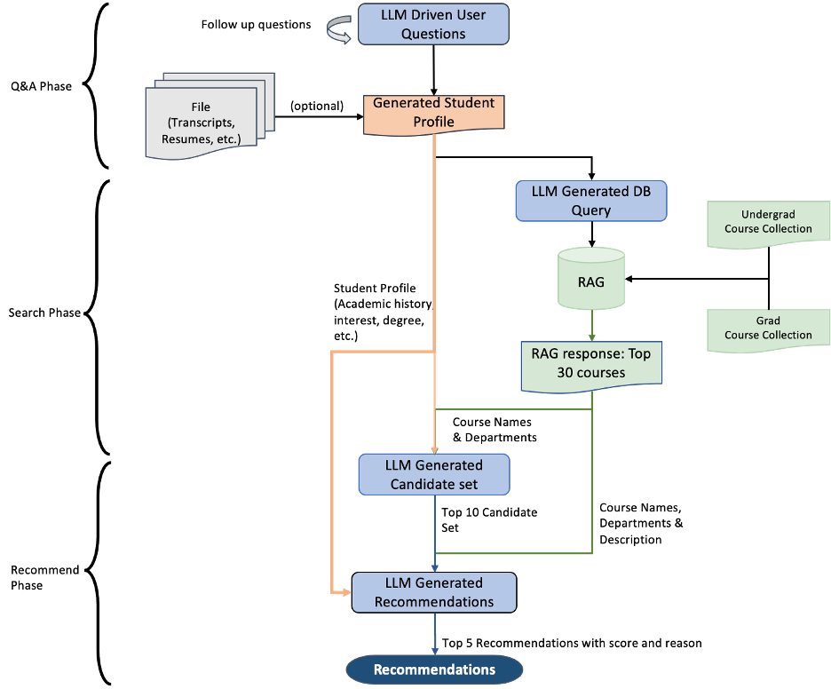
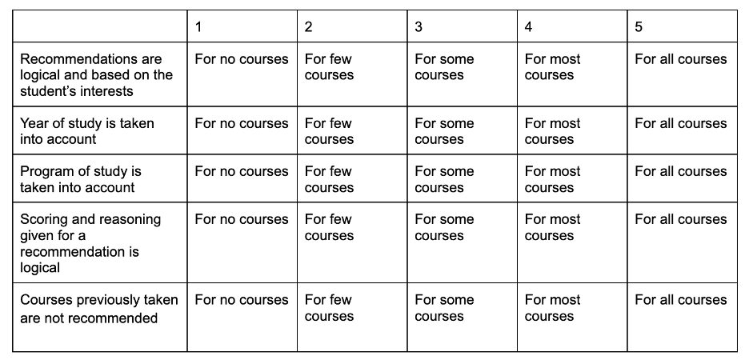

# CourseCompanion
CourseCompanion is an innovative chatbot designed to assist University of Toronto students in finding courses that suit their academic needs and interests. Utilizing a GPT-based conversational pipeline, alongside advanced techniques from the fields of Language Model (LLM) and Retrieval-Augmentation-Generation, this tool offers personalized course recommendations to students at every level of their academic journey.


## Background

Navigating course selection at UofT presents challenges due to a system that lacks customization for individual interests, academic goals, and abilities. The abundance of options compounds stress, leading to suboptimal choices and setbacks.
* CourseCompanion addresses this by providing tailored course recommendations based on an in-depth understanding of UofT's unique data, including department descriptions, current courses, and prerequisites. 
* The system considers students' academic history, achievements, interests, industry experience, research, and future goals. Machine learning enhances adaptability to diverse courses and student experiences. 
* Unlike human advisors, the AI system is available 24/7, offering a comprehensive and adaptable approach to support students in their academic journey.


## Features 
### Back-end
* A sophisticated chatting pipeline utilizing LangChain and OpenAI GPT-4 to analyze students' profiles and provide course recommendations.
* Use of Chroma DB to index the latest course files across the entire school.
* Django backend with SQLite3 as the database.
* Local SSL support for testing secure cookies and other secure protocols.
* Built an OAuth2 provider using the Django OAuth Toolkit to authenticate users.
* Integration of Celery to scale the system to handle increased traffic and concurrent user actions.
* Inclusive Swagger API documentation generated by drf-yasg.

### Front-end
* Vue.js framework for a user-friendly interface.
* Support for user registration and login.
* Internationalization (i18n) for multi-language support.
* Toggle feature for switching between graduate and undergraduate modes.
* Support for multiple concurrent conversations same as ChatGPT.
* File upload capability for course lists, personal resumes, and transcripts.


## Video Demo
It's an old demo so some new features are not included.

[](https://youtu.be/nTQUwghvy5Q)


## Run CourseCampanion

### To run the backend server:

1. `cd server`

2. Create the `.env` file in this directory. You can find a template in `example.env`.
   
3. Set up a local HTTPS environment. You can either:
   1. Generate a self-signed certificate with OpenSSL. Make sure there's a `cert.pem` and a `key.pem` in this directory.
   2. Use [Localtunnel](https://theboroer.github.io/localtunnel-www/). (In this case, use `runserver` command in the docker-compose.yml)

4. (option) Build the docker image if you want:
   
   `docker build -t yourimagename .`

5. Run Docker Compose:

   `docker compose up`

   * The backend server will be running at `https://localhost:1234`.
   * See APIs in `https://127.0.0.1:1234/swagger/`

### To run the User interface:
1. `cd UI`

2. Copy the `.env` file to this directory.

3. `npm install`

4. `npm run dev`
    * The user interface will be running at `http://localhost:3000`


## Pipeline


1. The Q&A Phase

    LangChain-powered, our system facilitates LLM-driven conversations, adapting prompt context dynamically. It extracts information interactively and can also parse data from PDF files, like Transcripts and Resumes, all integrated into the student profile.
2. The Search Phase

    This phase condenses the student profile into a search-optimized query, used to search ChromaDB for the top 30 results. The LLM prompt uses chain-of-thought reasoning to create a query that focuses on the keywords, departments, and filters to either the undergraduate or graduate course collection. This prompt query will then be used as the search terms against the ChromaDB course collection. 

3. The Recommendation Phase

    This phase involves two key steps: candidate selection and final recommendation. First, from the initial 30 courses in the search result, the top 10 are chosen based on course names, department, and year of study, using the complete student profile. This approach helps narrow down options without requiring detailed descriptions for all 30, ensuring compatibility with the context window limitations of GPT-4. The final recommendation then takes these 10 candidates along with their full course description for final recommendation. 

## Evaluation

1. Q&A Evaluation
   In the Q&A Phase, we used a 'Consistency Score,' a systematic metric generated by GPT, to assess the relevance of CampusCompanion's summaries to the original student profiles. The following code illustrates the manually set criteria for this score.
    ```
    Score 1: The answer is completely unrelated to the reference.
    Score 3: The answer has minor relevance but does not align with the reference.
    Score 5: The answer has moderate relevance but contains inaccuracies.
    Score 7: The answer aligns with the reference but has minor errors or omissions.
    Score 10: The answer is completely accurate and aligns perfectly with the reference.
    ```
    Metrics:
    |  | Consistency Score |
    |--|----------|
    | gpt-3.5-turbo | 6.94 |
    | gpt-4-1106-preview | 8.33 |
    
2. Recommendation Evaluation

   In the Recommendation Phase, employed Recall, HitRatio and NDCG(Normalized Discounted Cumulative Gain) to evaluate the recommendation list.
    $$
    \begin{align*}
    Recall &= \frac{\#of \ courses\ taken\ predicted\ by\ model}{\#of\ courses\ actually\ taken\ by\ the\ student} \\
    HitRatio &= \frac{\#of\ recommended\ courses\ suitable\ for\ the\ student}{\#of\ recommended\ courses}\\
    NDCG &= \frac{DCG_p}{IDCG_p}
    \end{align*}
    $$
    Metrics:
    |  | Recall | Hit Ratio@5 | NDCG@5 |
    |--|----------|---|--------|
    | gpt-3.5-turbo| 26.3% |67.5% | 0.93 |
    | gpt-4-1106-preview |37.7%| 87.5% | 0.96 | 0.93 |


3. Qualitative System Evaluation
   
   We also assessed the recommendation quality through a manual rating system that gauged the recommendation lists' quality on a rubric from 0 to 5, with human input. Given the subjective nature of recommendations, this manual evaluation provides a nuanced approach to evaluating their quality. The scale was defined as:
   

    Metrics:
    | Quality Score | 0 | 1| 2| 3| 4| 5|
    |--|---|--|--|-|--|--|
    | Times | 2 | 3 | 3 | 7 | 9 | 6 |


## Testing
Test code in `test`:

* `generator.py` is for Synthetic data generation. It generates students' information and saves it into `student_info.json`.
* `stuModel.py` provides `StuModel` to act as a Student to interact with Advior and use Scoring Evaluator to evaluate the result.


## TODO:
- [ ] UI: Better course data upload interface.
- [ ] UI: More user setting functions like avatar and nickname.
- [ ] Function: Automatically course data scrape.
- [ ] Function: Support anonymous users.
- [ ] Function: Support social accounts login such as Google using OAuth 2.0 for authentication.
